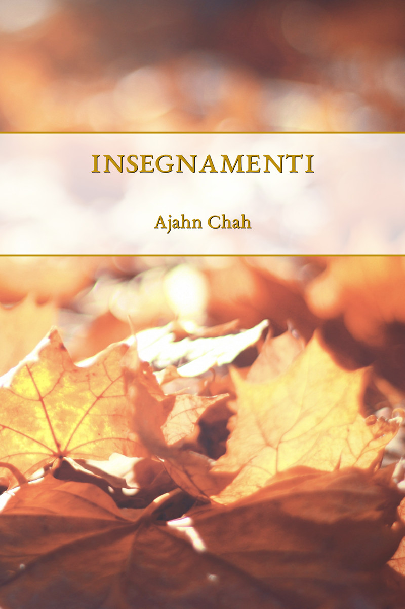

= Ajahn Chah Insegnamenti
:booktitle: {doctitle}
:author: Ajahn Chah
:creator: {author}
:version: v1.0
:revdate: 2019-04-13
:doctype: book
:lang: it
:pubs-logo: edizioni-santacittarama-w400.jpg
:publisher-name: Edizioni Santacittarama
:publisher-link-name: www.santacittarama.org
:publisher-link-url: http://www.santacittarama.org
:source: http://forestsangha.org/
:keywords: Ajahn Chah, teachings, insegnamenti, Dhamma, Buddhism, RELIGION / Buddhism / Theravada
:copyright: CC-BY-NC-ND 4.0
:isbn: 000-0-00000-000-0
:identifier: isbn:{isbn}
:imagesdir: assets/photos/92dpi-ebook-sRGB
:includes: manuscript/asciidoc
:front-cover-image: 
:toc: left
:toc-title: Indice
:toclevels: 0

include::{includes}/titlepage.adoc[]

include::{includes}/dedication.adoc[]

include::{includes}/preface.adoc[]

include::{includes}/nota-ai-testi.adoc[]

include::{includes}/introduzione.adoc[]

// PRATICA QUOTIDIANA

include::{includes}/la-via-di-mezzo.adoc[]

include::{includes}/al-di-la.adoc[]

include::{includes}/convenzione-e-liberazione.adoc[]

include::{includes}/senza-dimora.adoc[]

include::{includes}/seduta-serale.adoc[]

include::{includes}/essere-attenti.adoc[]

include::{includes}/si-puo-fare.adoc[]

include::{includes}/comprendere-la-sofferenza.adoc[]

include::{includes}/il-dhamma-va-in-occidente.adoc[]

include::{includes}/una-parola-e-gia-abbastanza.adoc[]

include::{includes}/rendere-buono-il-cuore.adoc[]

include::{includes}/perche-siamo-qui.adoc[]

include::{includes}/la-nostra-vera-casa.adoc[]

include::{includes}/le-quattro-nobili-verita.adoc[]

include::{includes}/vivere-nel-mondo.adoc[]

include::{includes}/dottrina-vuota.adoc[]

include::{includes}/trascendenza.adoc[]

// RATICA FORMALE

include::{includes}/insegnamenti-senza-tempo.adoc[]

include::{includes}/frammenti-di-un-insegnamento.adoc[]

//include::{includes}/un-dono-di-dhamma.adoc[]
//
//include::{includes}/vivere-con-un-cobra.adoc[]
//
//include::{includes}/la-mente-naturale.adoc[]
//
//include::{includes}/fatelo.adoc[]
//
//include::{includes}/domande-e-risposte.adoc[]
//
//include::{includes}/pratica-costante.adoc[]
//
//include::{includes}/attivita-distaccata.adoc[]
//
//include::{includes}/addestrare-la-mente.adoc[]
//
//include::{includes}/tranquillita-e-visione-profonda.adoc[]
//
//include::{includes}/il-sentiero-in-armonia.adoc[]
//
//include::{includes}/dove-c-e-frescura.adoc[]
//
//include::{includes}/il-monastero-della-confusione.adoc[]
//
//include::{includes}/conoscere-il-mondo.adoc[]
//
//include::{includes}/consigli-per-la-meditazione.adoc[]
//
//include::{includes}/acqua-ferma-che-scorre.adoc[]
//
//include::{includes}/verso-l-incondizionato.adoc[]
//
//include::{includes}/chiara-visione-profonda.adoc[]
//
//include::{includes}/imparare-ad-ascoltare.adoc[]
//
//include::{includes}/una-pace-incrollabile.adoc[]
//
//include::{includes}/solo-questo.adoc[]

// RATICA DELLA RINUNCIA

//include::{includes}/che-cos-e-la-contemplazione.adoc[]
//
//include::{includes}/la-natura-del-dhamma.adoc[]
//
//include::{includes}/i-due-volti-della-realta.adoc[]
//
//include::{includes}/l-addestramento-del-cuore.adoc[]
//
//include::{includes}/dove-l-onda-finisce.adoc[]
//
//include::{includes}/la-battaglia-del-dhamma.adoc[]
//
//include::{includes}/comprendere-il-vinaya.adoc[]
//
//include::{includes}/un-buon-livello-di-pratica.adoc[]
//
//include::{includes}/sommersi-dai-sensi.adoc[]
//
//include::{includes}/nel-cuore-della-notte.adoc[]
//
//include::{includes}/una-sorgente-di-saggezza.adoc[]
//
//include::{includes}/non-e-sicuro.adoc[]
//
//include::{includes}/con-tutto-il-cuore.adoc[]
//
//include::{includes}/retto-contenimento.adoc[]
//
//include::{includes}/soffrire-in-cammino.adoc[]
//
//include::{includes}/l-occhio-del-dhamma.adoc[]
//
//include::{includes}/il-sentiero-verso-la-pace.adoc[]
//
//include::{includes}/i-gabinetti-e-il-sentiero.adoc[]
//
//include::{includes}/un-messaggio-dalla-thailandia.adoc[]
//
//include::{includes}/glossary.adoc[]
//
//include::{includes}/copyright.adoc[]

